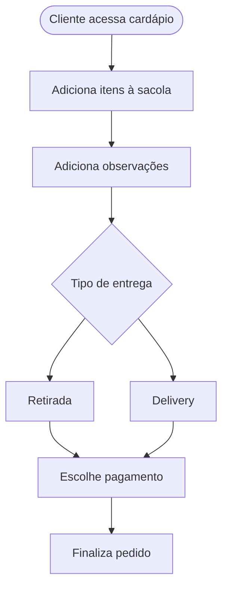

## Caso de Uso: CU01 - Realizar Pedido

### Nome
Realizar Pedido

### Descrição
Permite que o cliente selecione itens do cardápio, adicione observações, escolha o tipo de entrega e finalize o pedido com o método de pagamento.

### Atores
- Cliente

### Pré-condições
1. O cliente está na interface do cardápio  
2. O sistema está online  
3. O cliente está autenticado (opcional)

### Fluxo Básico
1. Cliente acessa a tela de cardápio  
2. Adiciona itens à sacola  
3. Adiciona observações (ex: “sem cebola”)  
4. Escolhe o tipo de entrega (retirada ou delivery)  
5. Escolhe o método de pagamento  
6. Finaliza o pedido

### Fluxos Alternativos
**Escolher outro método de entrega**  
1. Cliente troca de retirada para delivery ou vice-versa  
2. Sistema atualiza o valor do pedido (se aplicável)  
3. Volta para o fluxo principal no passo 5

### Fluxos de Exceção
**E1 - Produto fora de estoque**  
1. Sistema informa item indisponível  
2. Cliente remove item e continua o pedido

**E2 - Pagamento não autorizado**  
1. Sistema informa erro no pagamento  
2. Cliente escolhe outro método e tenta novamente

### Pós-condições
1. Pedido salvo no sistema  
2. Cliente recebe confirmação  
3. Pedido é encaminhado para aprovação

### Requisitos Relacionados
- RF01 - Seleção de itens do cardápio  
- RF02 - Adição de observações  
- RF03 - Escolha de entrega e pagamento

### Interface de Usuário
Tela de cardápio + sacola lateral com botão de “Finalizar Pedido”

### Diagrama

---

