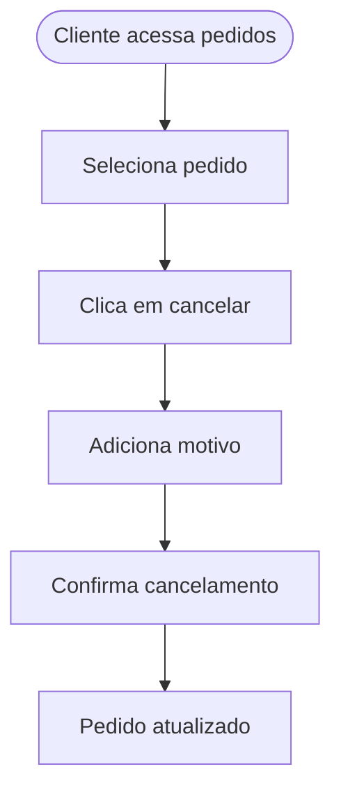
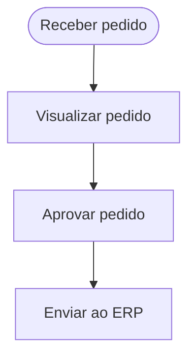

## Caso de Uso: CU01 - Realizar Pedido

### Nome
Realizar Pedido

### Descrição
Permite que o cliente selecione itens do cardápio, adicione observações, escolha o tipo de entrega e finalize o pedido com o método de pagamento.

### Atores
- Cliente

### Pré-condições
1. O cliente está na interface do cardápio  
2. O sistema está online  
3. O cliente está autenticado (opcional)

### Fluxo Básico
1. Cliente acessa a tela de cardápio  
2. Adiciona itens à sacola  
3. Adiciona observações (ex: “sem cebola”)  
4. Escolhe o tipo de entrega (retirada ou delivery)  
5. Escolhe o método de pagamento  
6. Finaliza o pedido

### Fluxos Alternativos
**Escolher outro método de entrega**  
1. Cliente troca de retirada para delivery ou vice-versa  
2. Sistema atualiza o valor do pedido (se aplicável)  
3. Volta para o fluxo principal no passo 5

### Fluxos de Exceção
**E1 - Produto fora de estoque**  
1. Sistema informa item indisponível  
2. Cliente remove item e continua o pedido

**E2 - Pagamento não autorizado**  
1. Sistema informa erro no pagamento  
2. Cliente escolhe outro método e tenta novamente

### Pós-condições
1. Pedido salvo no sistema  
2. Cliente recebe confirmação  
3. Pedido é encaminhado para aprovação

### Requisitos Relacionados
- RF01 - Seleção de itens do cardápio  
- RF02 - Adição de observações  
- RF03 - Escolha de entrega e pagamento

### Interface de Usuário
Tela de cardápio + sacola lateral com botão de “Finalizar Pedido”

### Diagrama

---

## Caso de Uso: CU02 - Cancelar Pedido

### Nome
Cancelar Pedido

### Descrição
Permite ao cliente cancelar um pedido em andamento, informando o motivo.

### Atores
- Cliente

### Pré-condições
1. Pedido ainda não foi aprovado pelo administrador  
2. Cliente autenticado

### Fluxo Básico
1. Cliente acessa seus pedidos  
2. Seleciona o pedido a ser cancelado  
3. Clica em “Cancelar Pedido”  
4. Informa o motivo do cancelamento  
5. Confirma o cancelamento  
6. Sistema atualiza o status do pedido

### Fluxos Alternativos
**Cliente volta atrás**  
1. Antes de confirmar, cliente desiste de cancelar  
2. Retorna ao histórico de pedidos

### Fluxos de Exceção
**E1 - Pedido já aprovado**  
1. Sistema informa que o pedido não pode mais ser cancelado  
2. Cliente é instruído a entrar em contato com suporte

### Pós-condições
1. Pedido com status "Cancelado"  
2. Motivo do cancelamento registrado no sistema

### Requisitos Relacionados
- RF06 - Cancelamento de pedido  
- RNF02 - Registro de motivo de cancelamento

### Interface de Usuário
Histórico de pedidos com botão “Cancelar” + campo de motivo

### Diagrama

---

## Caso de Uso: CU03 - Receber e Aprovar Pedido

### Nome
Receber e Aprovar Pedido

### Descrição
O administrador recebe o pedido feito pelo cliente, aprova e registra no ERP.

### Atores
- Administrador

### Pré-condições
1. Pedido foi finalizado pelo cliente  
2. Sistema de ERP está disponível

### Fluxo Básico
1. Administrador recebe notificação de novo pedido  
2. Acessa painel de pedidos  
3. Visualiza detalhes do pedido  
4. Aprova o pedido  
5. Pedido é inserido automaticamente no ERP

### Fluxos Alternativos
**Pedido precisa de correção**  
1. Administrador entra em contato com cliente  
2. Cliente edita ou refaz o pedido

### Fluxos de Exceção
**E1 - Erro de integração com ERP**  
1. Sistema tenta enviar o pedido  
2. Falha é detectada  
3. Administrador é alertado  
4. Tenta novamente ou registra manualmente

### Pós-condições
1. Pedido aprovado e registrado no ERP  
2. Pedido liberado para produção/entrega

### Requisitos Relacionados
- RF08 - Aprovação de pedidos  
- RF09 - Integração com ERP (Odoo)

### Interface de Usuário
Painel administrativo com lista de pedidos pendentes + botão "Aprovar"

### Diagrama

