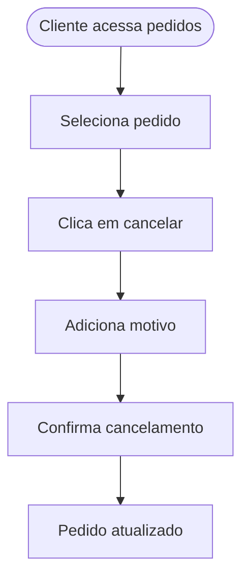

## Caso de Uso: CU02 - Cancelar Pedido

### Nome
Cancelar Pedido

### Descrição
Permite ao cliente cancelar um pedido em andamento, informando o motivo.

### Atores
- Cliente

### Pré-condições
1. Pedido ainda não foi aprovado pelo administrador  
2. Cliente autenticado

### Fluxo Básico
1. Cliente acessa seus pedidos  
2. Seleciona o pedido a ser cancelado  
3. Clica em “Cancelar Pedido”  
4. Informa o motivo do cancelamento  
5. Confirma o cancelamento  
6. Sistema atualiza o status do pedido

### Fluxos Alternativos
**Cliente volta atrás**  
1. Antes de confirmar, cliente desiste de cancelar  
2. Retorna ao histórico de pedidos

### Fluxos de Exceção
**E1 - Pedido já aprovado**  
1. Sistema informa que o pedido não pode mais ser cancelado  
2. Cliente é instruído a entrar em contato com suporte

### Pós-condições
1. Pedido com status "Cancelado"  
2. Motivo do cancelamento registrado no sistema

### Requisitos Relacionados
- RF06 - Cancelamento de pedido  
- RNF02 - Registro de motivo de cancelamento

### Interface de Usuário
Histórico de pedidos com botão “Cancelar” + campo de motivo

### Diagrama

---
