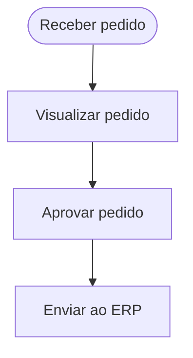

## Caso de Uso: CU03 - Receber e Aprovar Pedido

### Nome
Receber e Aprovar Pedido

### Descrição
O administrador recebe o pedido feito pelo cliente, aprova e registra no ERP.

### Atores
- Administrador

### Pré-condições
1. Pedido foi finalizado pelo cliente  
2. Sistema de ERP está disponível

### Fluxo Básico
1. Administrador recebe notificação de novo pedido  
2. Acessa painel de pedidos  
3. Visualiza detalhes do pedido  
4. Aprova o pedido  
5. Pedido é inserido automaticamente no ERP

### Fluxos Alternativos
**Pedido precisa de correção**  
1. Administrador entra em contato com cliente  
2. Cliente edita ou refaz o pedido

### Fluxos de Exceção
**E1 - Erro de integração com ERP**  
1. Sistema tenta enviar o pedido  
2. Falha é detectada  
3. Administrador é alertado  
4. Tenta novamente ou registra manualmente

### Pós-condições
1. Pedido aprovado e registrado no ERP  
2. Pedido liberado para produção/entrega

### Requisitos Relacionados
- RF08 - Aprovação de pedidos  
- RF09 - Integração com ERP 

### Interface de Usuário
Painel administrativo com lista de pedidos pendentes + botão "Aprovar"

### Diagrama

