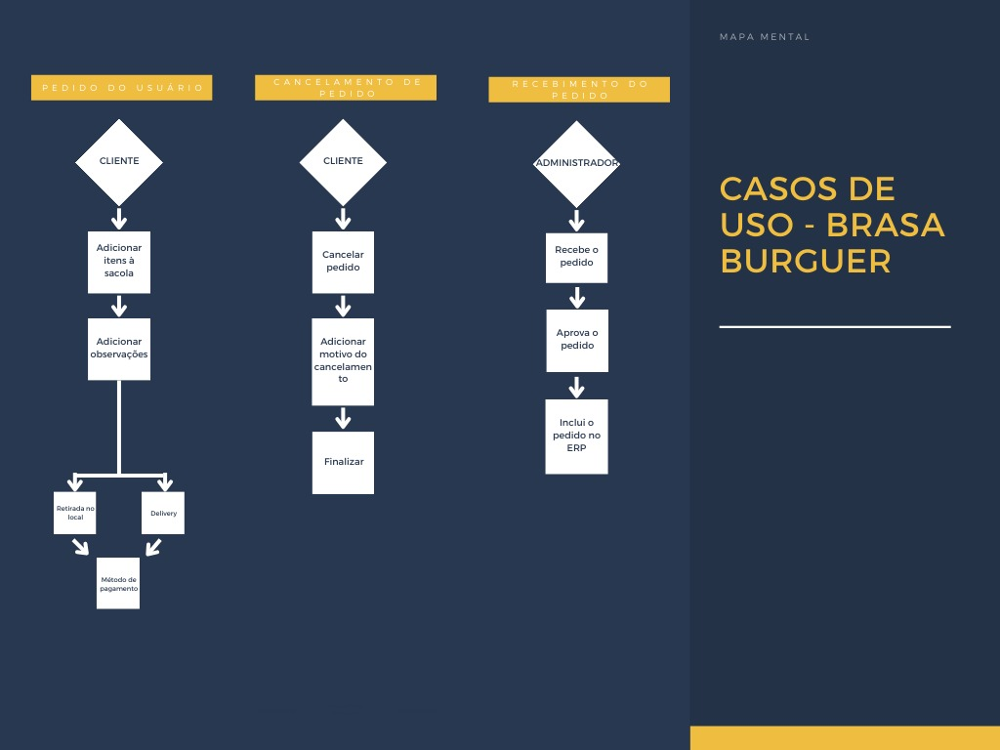
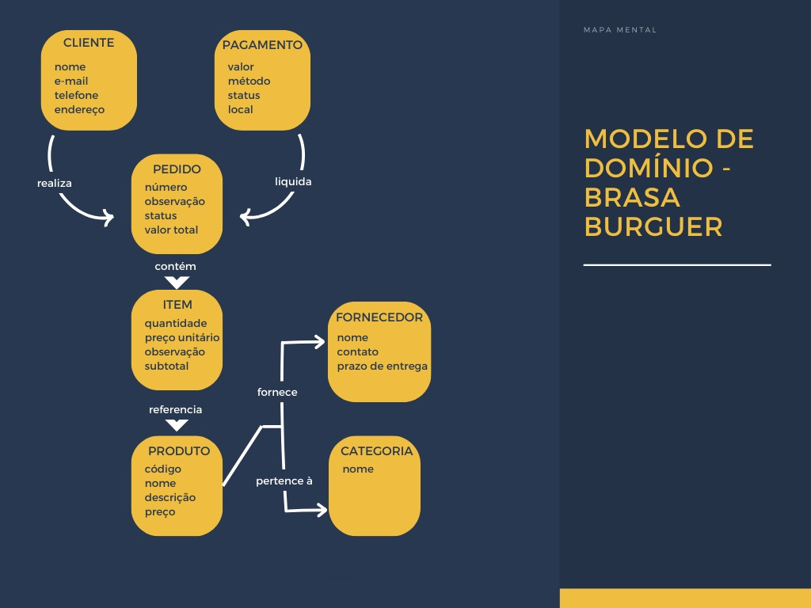

# 3) Casos de Uso e Modelo de domínio

# Requisitos Não-Funcionais e Estratégia de Atendimento

| Requisito Não-Funcional | Descrição | Estratégia para Atendimento |
|-------------------------|-----------|-----------------------------|
| **Desempenho** | O sistema deve carregar rapidamente e processar pedidos sem lentidão. | Uso de cache para dados do cardápio, otimização de imagens, e banco de dados indexado. |
| **Usabilidade** | Interface intuitiva e responsiva para fácil navegação. | Design baseado em UX/UI, teste com usuários e adaptação para mobile-first. |
| **Segurança** | Garantia da proteção dos dados do cliente, especialmente no login e pagamentos. | Criptografia de senhas, autenticação segura e protocolo HTTPS. |
| **Escalabilidade** | O site deve suportar aumento no volume de acessos e pedidos. | Arquitetura baseada em microsserviços e possibilidade de escalonamento automático no servidor. |
| **Disponibilidade** | O sistema deve estar disponível 24/7 para os clientes. | Uso de servidores redundantes e monitoramento de uptime. |

# 4) Histórias seguindo os Critérios INVEST

### 1) Como um cliente, quero acessar o site e navegar facilmente pelas seções, para encontrar rapidamente as informações que desejo.
**Critérios de aceitação**

O site deve ter um índice fixo no topo com links para as principais seções. O carregamento do índice e das seções deve ser inferior a 3 segundos. 
### 2) Como um cliente, quero visualizar o cardápio de forma organizada por categorias, para encontrar facilmente os produtos disponíveis.
**Critérios de aceitação**

O cardápio deve ser organizado por categorias destacadas, exibindo imagens, nome, preço e descrições breves dos itens. O layout deve ser responsivo e o tempo de carregamento inferior a 3 segundos.
### 3) Como um cliente, quero clicar em um item do cardápio e visualizar mais informações sobre ele, para decidir se quero comprá-lo. Critérios de aceitação: Ao clicar no produto, um pop-up deve exibir detalhes, preço e opções para adicioná-lo à sacola.
**Critérios de aceitação**

 Ao clicar no produto, um pop-up deve exibir detalhes, preço e opções para adicioná-lo à sacola.
### 4) Como um cliente, quero adicionar itens à minha sacola, para poder fazer meu pedido de forma prática. 
**Critérios de aceitação**

A sacola deve ser acessível a qualquer momento e exibir os itens adicionados. 
### 5) Como um cliente, quero me cadastrar e fazer login no site, para salvar meus dados e agilizar futuras compras.
**Critérios de aceitação** 

O sistema deve permitir cadastro com nome, e-mail, senha e endereço, além de login com esses dados. A senha deve ser segura, o e-mail não pode estar duplicado e o cliente deve permanecer logado até sair ou ficar inativo.
### 6) Como um cliente, quero revisar os itens no meu carrinho e confirmar meu pedido, para concluir minha compra com segurança.
**Critérios de aceitação** 

O site deve exibir um resumo do pedido, incluindo nome, quantidade, preço dos itens e total da compra. O cliente deve poder remover ou ajustar a quantidade dos itens antes da finalização. Antes de concluir a compra, o sistema deve solicitar a confirmação do pedido.
### 7) Como um cliente, quero um canal de contato direto com o estabelecimento, para tirar dúvidas ou resolver problemas com meu pedido.
**Critérios de aceitação**

 O site deve disponibilizar opções de contato, incluindo telefone, WhatsApp e um formulário de mensagem. As informações de contato devem ser facilmente acessíveis e o formulário deve permitir o envio de nome, e-mail e mensagem.
### 8) Como um cliente, quero ver as promoções em destaque na página inicial, para conhecer as melhores ofertas.
**Critérios de aceitação** 

O site deve exibir um carrossel de imagens na página inicial, destacando promoções e novidades. 

### 9) Como um cliente, quero filtrar os produtos do cardápio por categoria, para encontrar rapidamente o que desejo.
**Critérios de aceitação** 

O site deve permitir a seleção de categorias como "Lanches", "Bebidas" e "Sobremesas", exibindo apenas os itens correspondentes. O filtro deve ser de fácil acesso e aplicar a seleção de forma rápida e intuitiva.
### 10) Como um cliente, quero poder adicionar observações ao meu pedido, para solicitar modificações específicas.
**Critérios de aceitação** 

Deve haver um campo de texto no pop-up do produto ou no carrinho, permitindo que o cliente insira observações sobre o pedido. As observações devem ser enviadas junto com o pedido para o estabelecimento.
### 11) Como um cliente, quero escolher a forma de pagamento ao finalizar o pedido, para pagar de maneira conveniente.
**Critérios de aceitação**

 O sistema deve oferecer opções de pagamento via cartão de crédito, débito, PIX ou dinheiro na entrega. O cliente deve poder selecionar a opção desejada antes de concluir o pedido.
### 12) Como um cliente, quero recuperar minha senha, para acessar minha conta caso eu a esqueça.

**Critérios de aceitação**

 O sistema deve oferecer uma opção de "Esqueci minha senha" na tela de login. Ao selecionar essa opção, o cliente deve informar seu e-mail cadastrado para receber um link de redefinição de senha. O link deve direcionar para uma página onde o cliente pode criar uma nova senha, garantindo critérios mínimos de segurança. Após a alteração, o cliente deve conseguir fazer login com a nova senha.

### 13) Como um cliente, quero acessar um histórico dos meus pedidos anteriores, para repetir compras facilmente.
**Critérios de aceitação** 

O site deve exibir uma lista dos pedidos anteriores com detalhes como data, itens e valor total. Deve haver uma opção para refazer o pedido com um clique, adicionando os mesmos itens ao carrinho.
### 14) Como um cliente, quero avaliar meu pedido após a entrega, para compartilhar minha experiência com outros usuários.
**Critérios de aceitação**

 O sistema deve permitir que o cliente atribua uma nota ao pedido usando um sistema de estrelas e adicione um comentário opcional. A avaliação só deve estar disponível após a finalização do pedido.
### 15) Como um cliente, quero ver o tempo estimado de entrega antes de finalizar meu pedido, para saber quanto tempo devo esperar.
**Critérios de aceitação**

 O sistema deve calcular e exibir um tempo estimado de entrega com base na localização do cliente e na demanda do estabelecimento. A estimativa deve ser apresentada antes da finalização do pedido.
### 16) Como um cliente, quero poder escolher entre entrega e retirada no local, para pegar meu pedido no estabelecimento se preferir.
**Critérios de aceitação**

Deve haver uma opção para selecionar "Delivery" ou "Retirada" antes de finalizar o pedido. A escolha deve impactar a exibição do tempo estimado e, no caso de retirada, informar o endereço do estabelecimento.
### 17) Como um cliente, quero poder sair da minha conta no site, para manter minha privacidade.
**Critérios de aceitação**

O sistema deve oferecer um botão de "Sair" acessível no menu superior. Ao clicar, a sessão do usuário deve ser encerrada, redirecionando-o para a página inicial.
### 18) Como um cliente, quero adicionar ingredientes extras ao meu lanche, para personalizar minha refeição conforme meu gosto.
**Critérios de aceitação**

 O sistema deve permitir a seleção de ingredientes adicionais no pop-up do produto, exibindo opções disponíveis e seus valores extras. Os itens escolhidos devem ser adicionados ao pedido e refletidos no preço final.
### 19) Como um cliente, quero poder editar meu pedido após finalizá-lo, para corrigir ou alterar algum detalhe antes da preparação.
**Critérios de aceitação**

O sistema deve permitir a edição do pedido dentro de um tempo limite ou antes do início da preparação. O cliente deve poder modificar itens, quantidades, observações e forma de pagamento. Caso a alteração impacte o valor total, o sistema deve atualizar o preço e solicitar confirmação antes de aplicar as mudanças.

 
# 6) Documentação de priorização e justificativas

### 1) Página Inicial
Razão: A página inicial é a primeira impressão que os usuários terão do site. Um carrossel de imagens com promoções pode atrair a atenção e incentivar os visitantes a explorar mais. É fundamental para a navegação e para direcionar o tráfego para outras partes do site.
### 2) Cardápio
Razão: O cardápio é uma das principais funcionalidades do site, especialmente se o objetivo é permitir que os clientes visualizem e escolham produtos. A interação com as imagens e a possibilidade de adicionar itens à sacola são essenciais para a experiência do usuário.
### 3) Sacola
Razão: A página da sacola é crucial para a finalização do pedido. Os usuários precisam ver os itens que escolheram e ter a opção de avançar para a finalização ou excluir itens. Sem essa funcionalidade, o processo de compra não pode ser concluído.
### 4) Login e Cadastro
Razão: A funcionalidade de login e cadastro é necessária para que os usuários possam gerenciar suas contas e pedidos. Isso é especialmente importante se o site requer que os clientes façam login para realizar compras.
### 5) Status do Pedido
Razão: Uma página que mostra o status do pedido e permite o cancelamento é importante para a transparência e a confiança do cliente. Os usuários querem saber onde está seu pedido e ter a opção de cancelá-lo, se necessário.
### 6) Contato
Razão: A página de contato é importante para que os clientes possam se comunicar com o estabelecimento. Ter informações de contato visíveis é essencial para a confiança e a credibilidade.
### 7) Quem Somos
Razão: Embora não seja crítica para a funcionalidade do site, a página "Quem Somos" ajuda a construir a identidade da marca e a conexão emocional com os clientes. É importante para a imagem do estabelecimento.
### 8) Categorias
Razão: As categorias ajudam a organizar o cardápio e a facilitar a navegação. No entanto, elas podem ser implementadas após as páginas principais, pois a funcionalidade básica do cardápio já estará disponível.
### 9) Saída ou Logout
Razão: A funcionalidade de logout é importante, mas pode ser considerada de menor prioridade em comparação com as outras páginas. Ela pode ser implementada após as funcionalidades principais, já que o logout pode ser feito de forma simples na interface.

# 8) Definition of ready

###  Como equipe, foi estabelecido que a definition of ready de cada requisito seja:

Layout da página finalizado
Um figma/canvas projetado antes do desenvolvimento do código, que contenha as funcionalidades do site bem posicionadas
Realização de uma reunião 
Foi estabelecido que anteriormente ao desenvolvimento, deve-se ter realizado pelo menos uma reunião acerca de cada sprint. 
Possuir um diagrama de funcionalidades
É necessário possuir um diagrama relacionando as funcionalidades de cada página

# 9) Matriz de rastreabilidade

## Objetivo 1: Melhorar a experiência do usuário

### Requisito 1: Design responsivo.

Requisito 1 contribui para a facilidade de navegação e acesso do usuário, melhorando a experiência geral.

### Requisito 2: Interface amigável e intuitiva

Requisito 2 facilita a navegação e ajuda os usuários a encontrarem rapidamente o que desejam. 

### Requisito 3: Sistema de busca eficiente

Requisito 3 permite aos usuários encontrar pratos ou categorias de comida rapidamente, melhorando a experiência. 

## Objetivo 2: Otimizar o processo de pedidos

### Requisito 4: Carrinho de compras intuitivo 

Requisito 4 facilita o processo de compra, reduzindo a taxa de abandono de carrinho e aumentando conversões.

### Requisito 5: Pagamento rápido e seguro

Requisito 5 assegura que o processo de pagamento seja seguro e eficiente, gerando confiança nos clientes.

### Requisito 6: Opção de pedido com entrega ou retirada

Requisito 6 oferece mais flexibilidade ao cliente, permitindo maior conveniência ao fazer pedidos. 

## Objetivo 3: Aumentar as vendas

### Requisito 7: Sistema de promoções e descontos

Requisito 7 pode atrair mais clientes e aumentar as vendas, oferecendo incentivos de compra.

###  Requisito 8: Avaliações de clientes

Requisito 8 permite que os clientes compartilhem suas experiências, o que pode aumentar a confiança e atrair mais compradores.

## Objetivo 4: Garantir a segurança e confiabilidade do site

### Requisito 9: Implementação de certificado SSL

Requisito 9 garante a segurança dos dados do cliente, essencial para a confiança no site. 

### Requisito 10: Backup de dados frequente

Requisito 10 assegura que os dados do site e dos usuários sejam protegidos em caso de falhas técnicas.

